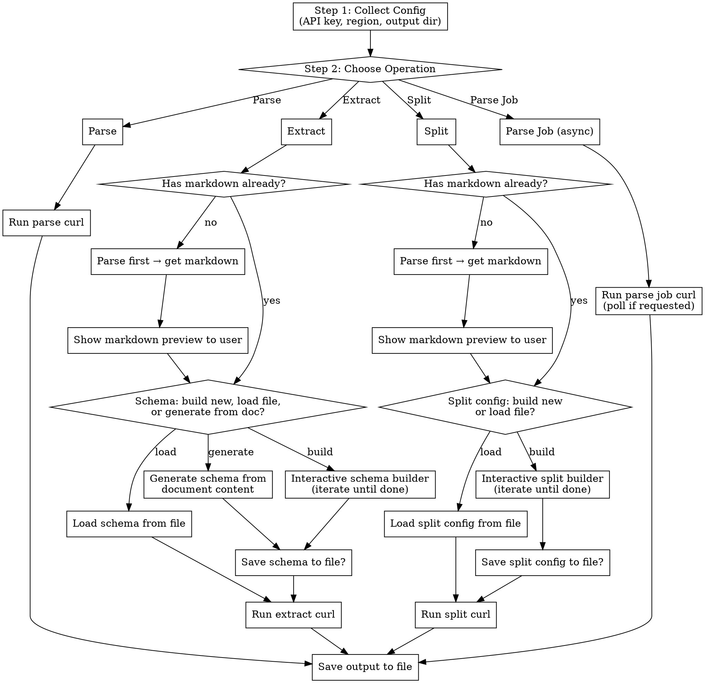

# LandingAI ADE — Interactive Document Extraction

## Overview

Guided wizard for LandingAI's Agentic Document Extraction API. Collects all config from the user via `AskUserQuestion`, then executes `curl` commands via `Bash`. Never write Python — always use curl.

## When to Use

- User wants to parse a document (PDF, image, spreadsheet) into markdown
- User wants to extract structured fields from a document
- User wants to classify/split a multi-document PDF
- User mentions LandingAI, ADE, vision agent, document AI

## CRITICAL RULES

1. **Extract and Split accept MARKDOWN, not raw files.** Always parse first if the user has a PDF/image.
2. **Auth is Bearer, not Basic.** Header: `Authorization: Bearer $VISION_AGENT_API_KEY`
3. **File field names:** `document` for parse, `markdown` for extract/split. Never `pdf`, `file`, etc.
4. **Always use `-F` (multipart form), never `-d` (JSON body).**
5. **Use `jq -r` when extracting markdown** to avoid escaped/quoted strings.
6. **NEVER read full output files into your context.** See Token Warnings below.

## TOKEN WARNINGS

Parse output is ~55,000 tokens per page (grounding bounding boxes = ~36,000 of that). 10 pages = ~550,000 tokens.

**Output handling rules:**
- **Always pipe curl output to a file:** `| jq . > output.json`
- **Show a small jq summary** after each operation (see Step 4)
- **If the user wants to see the full output:** use `cat` via Bash so it displays in their terminal
- **If the user wants to analyze the output:** use Bash commands (`jq`, `grep`, `wc`, `head`, `tail`, etc.) to query the file and return only the targeted answer. Do NOT read the whole file into context. Examples:
  ```bash
  # Count chunks by type
  jq '[.chunks[] | .type] | group_by(.) | map({type: .[0], count: length})' output.json
  # Find chunks containing a keyword
  jq '.chunks[] | select(.markdown | test("invoice"; "i")) | {id, type, markdown}' output.json
  # Get page count
  jq '.metadata.page_count' output.json
  # List all unique grounding types
  jq '[.grounding | to_entries[].value.type] | unique' output.json
  ```
- **Never use the Read tool** on parse/extract/split output files
- **For markdown preview:** `head -20` on the saved .md file

**Summary queries (use after every operation):**
```bash
# Parse (~430 tokens instead of ~55,000):
jq '{md_preview: (.markdown | .[0:500]), chunks: (.chunks | length), types: ([.chunks[].type] | unique), metadata: .metadata}' parse_output.json
# Extract (~500 tokens):
jq '.extraction' extract_output.json
# Split (~200 tokens):
jq '[.splits[] | {classification, pages, identifier}]' split_output.json
```

## Workflow



## Step 1: Collect Configuration

Use `AskUserQuestion` to gather ALL of these upfront:

**Question 1 — API Key:**

> "What is your VISION_AGENT_API_KEY? (Type 'env' if it's already set as an environment variable)"

- If `env`: use `$VISION_AGENT_API_KEY` in all commands. Validate with:
  ```bash
  if [ -z "$VISION_AGENT_API_KEY" ]; then echo "ERROR: VISION_AGENT_API_KEY not set"; fi
  ```
- Otherwise: store the provided value and use it directly in commands.

**Question 2 — Region:**

> Options: `US (default)`, `EU`

| Region | Base URL                              |
| ------ | ------------------------------------- |
| US     | `https://api.va.landing.ai`           |
| EU     | `https://api.va.eu-west-1.landing.ai` |

**Question 3 — Operation:**

> Options: `Parse`, `Extract`, `Split`, `Parse Job (async)`

**Question 4 — Output Directory:**

> "Where should output files be saved? (e.g., ./output)"

Then `mkdir -p` the output directory.

## Step 2: Collect Operation-Specific Inputs

### For Parse

Ask:

1. "Local file path or URL?" → determines `document=@/path` vs `document_url=https://...`
2. "Split by page?" → yes adds `-F "split=page"`

### For Extract

Ask:

1. "Local file path or URL to your document? (PDF/image for raw file, or .md if already parsed)"
2. Detect file type:
   - If `.md` file → use directly as markdown input, skip to schema step
   - If PDF/image → **parse first**, save markdown, show preview to user
3. Schema source (see Schema Builder section below)

### For Split

Ask:

1. "Local file path or URL to your document?"
2. Same parse-first logic as Extract
3. Split config source (see Split Builder section below)

### For Parse Job

Ask:

1. "Local file path or URL?"
2. "Poll until complete?" → yes/no

## Schema Builder (for Extract)

After the user has markdown (either provided or from parsing), offer three choices via `AskUserQuestion`:

> "How do you want to define your extraction schema?"
>
> - **Build interactively** — I'll walk you through adding fields one by one
> - **Generate from document** — I'll analyze the parsed markdown and suggest a schema
> - **Load from file** — Load a previously saved schema JSON file

### Option A: Build Interactively

Loop until the user says done:

1. Ask: "Field name? (e.g., invoice_number, vendor_name, total_amount)"
2. Ask: "Field type?"
   - Options: `string`, `number`, `boolean`, `array of strings`, `array of objects`
3. Ask: "Description? (helps the model understand what to look for)"
4. If `array of objects`: recursively ask for sub-fields
5. Show the current schema so far
6. Ask: "Add another field, edit a field, remove a field, or done?"
   - **Add another** → repeat from step 1
   - **Edit** → ask which field, then re-ask type/description
   - **Remove** → ask which field to remove
   - **Done** → finalize schema

Assemble into JSON:

```json
{
  "type": "object",
  "properties": {
    "invoice_number": { "type": "string", "description": "Invoice number" },
    "total_amount": { "type": "number", "description": "Total dollar amount" },
    "line_items": {
      "type": "array",
      "items": {
        "type": "object",
        "properties": {
          "description": {
            "type": "string",
            "description": "Item description"
          },
          "amount": { "type": "number", "description": "Line item amount" }
        }
      }
    }
  }
}
```

### Option B: Generate from Document

1. Read the parsed markdown content (from the parse output file)
2. Analyze the markdown to identify extractable fields — look for:
   - **Key-value patterns**: lines like `Invoice #: 12345`, `Name: ___`, `Date: 01/15/2024`
   - **Table headers**: column names in markdown tables suggest array-of-object fields
   - **Labeled sections**: `Section 2: Insurance Information` suggests grouped fields
   - **Repeated structures**: multiple similar entries suggest `array` types
   - **Checkboxes/booleans**: `[x]` or `Yes/No` fields → `boolean` type
   - **Numeric values**: amounts, totals, quantities → `number` type
   - **Dates**: any date-like content → `string` with date description
3. Build a JSON schema from the detected fields (use `string` as default type when uncertain)
4. Present the suggested schema to the user showing each field name, type, and description
5. Ask: "Does this look right? Edit any fields, or accept?"
6. Allow iterative edits (same add/edit/remove loop as Option A)

### Option C: Load from File

1. Ask: "Path to your schema JSON file?"
2. Read and validate the file:
   ```bash
   cat /path/to/schema.json | jq .
   ```
3. Show it to the user for confirmation
4. Allow edits if needed

### Save Schema

After finalizing (any option), ask:

> "Save this schema for reuse? (provide a file path, or 'no')"

If yes:

```bash
cat << 'SCHEMA_EOF' > /path/to/schema.json
{ ... the schema ... }
SCHEMA_EOF
```

## Split Config Builder (for Split)

After the user has markdown, offer two choices:

> "How do you want to define your split classifications?"
>
> - **Build interactively** — I'll walk you through adding categories
> - **Load from file** — Load a previously saved split config

### Option A: Build Interactively

Loop until done:

1. Ask: "Category name? (e.g., 'Bank Statement', 'Pay Stub', 'Invoice')"
2. Ask: "Description? (what does this document type look like?)"
3. Ask: "Identifier field? (optional — a field to group/partition by, e.g., 'Account Number', 'Invoice Date'). Type 'none' to skip."
4. Show current config so far
5. Ask: "Add another category, edit one, remove one, or done?"

Assemble into JSON array:

```json
[
  {
    "name": "Bank Statement",
    "description": "Bank account activity summary over a period"
  },
  {
    "name": "Pay Stub",
    "description": "Employee earnings and deductions",
    "identifier": "Pay Stub Date"
  },
  {
    "name": "Invoice",
    "description": "Bill for goods or services",
    "identifier": "Invoice Number"
  }
]
```

### Option B: Load from File

Same pattern as schema loading — read, validate, confirm, allow edits.

### Save Split Config

After finalizing, ask:

> "Save this split config for reuse?"

If yes, write to the specified path.

## Step 3: Execute

### Parse Command

```bash
curl -s -X POST "${BASE_URL}/v1/ade/parse" \
  -H "Authorization: Bearer ${API_KEY}" \
  -F "document=@/path/to/file.pdf" \
  -F "model=dpt-2-latest" | jq . > ${OUTPUT_DIR}/parse_output.json
```

For URL input, replace `-F "document=@..."` with `-F "document_url=https://..."`.
For page splitting, add `-F "split=page"`.

### Extract Command (after parse + schema built)

```bash
curl -s -X POST "${BASE_URL}/v1/ade/extract" \
  -H "Authorization: Bearer ${API_KEY}" \
  -F "markdown=@/path/to/parsed_markdown.md" \
  -F "model=extract-latest" \
  -F "schema=$(cat /path/to/schema.json)" | jq . > ${OUTPUT_DIR}/extract_output.json
```

### Split Command (after parse + split config built)

```bash
curl -s -X POST "${BASE_URL}/v1/ade/split" \
  -H "Authorization: Bearer ${API_KEY}" \
  -F "markdown=@/path/to/parsed_markdown.md" \
  -F "model=split-latest" \
  -F "split_class=$(cat /path/to/split_config.json)" | jq . > ${OUTPUT_DIR}/split_output.json
```

### Parse Job Commands

```bash
# Create
JOB_ID=$(curl -s -X POST "${BASE_URL}/v1/ade/parse/jobs" \
  -H "Authorization: Bearer ${API_KEY}" \
  -F "document=@/path/to/file.pdf" \
  -F "model=dpt-2-latest" | jq -r '.job_id')
echo "Job: $JOB_ID"

# Poll
while true; do
  RESP=$(curl -s "${BASE_URL}/v1/ade/parse/jobs/$JOB_ID" \
    -H "Authorization: Bearer ${API_KEY}")
  STATUS=$(echo "$RESP" | jq -r '.status')
  echo "Status: $STATUS | Progress: $(echo "$RESP" | jq -r '.progress')"
  [ "$STATUS" = "completed" ] || [ "$STATUS" = "failed" ] && break
  sleep 5
done
echo "$RESP" | jq . > ${OUTPUT_DIR}/job_result.json

# List jobs
curl -s "${BASE_URL}/v1/ade/parse/jobs?status=completed&page=0&pageSize=10" \
  -H "Authorization: Bearer ${API_KEY}" | jq .
```

## Step 4: Present Results

After execution:

1. Show the user a summary of the output (key fields, not the full JSON dump)
2. Tell them where the file was saved
3. For Extract: show the `.extraction` object formatted nicely
4. For Split: show each `.splits[].classification` with page ranges
5. Ask: "Want to run another operation on this document?"

## Response Structure Reference

### Parse Response

```
.markdown          → full document markdown
.chunks[]          → {id, markdown, type, grounding: {box, page}}
.metadata          → {credit_usage, duration_ms, filename, job_id}
.splits[]          → {class, identifier, markdown, pages[], chunks[]}
```

### Extract Response

```
.extraction        → the extracted key-value pairs (matches your schema)
.extraction_metadata → key-values with chunk_reference for grounding
.metadata          → {credit_usage, duration_ms, filename, job_id}
.metadata.schema_violation_error → non-null if extraction didn't match schema
```

### Split Response

```
.splits[]          → {classification, identifier, markdowns[], pages[]}
.metadata          → {credit_usage, duration_ms, filename, page_count}
```

### Job Response

```
.job_id, .status   → pending|processing|completed|failed|cancelled
.progress          → 0.0 to 1.0
.data              → full parse response when completed
.output_url        → presigned URL if result > 1MB (expires 1hr)
.failure_reason    → error details if failed
```

## Quick Reference

| Endpoint   | Method | Path                      | Model            | Input                                                      |
| ---------- | ------ | ------------------------- | ---------------- | ---------------------------------------------------------- |
| Parse      | POST   | `/v1/ade/parse`           | `dpt-2-latest`   | `document` (file) or `document_url`                        |
| Extract    | POST   | `/v1/ade/extract`         | `extract-latest` | `markdown` (file/string) or `markdown_url` + `schema`      |
| Split      | POST   | `/v1/ade/split`           | `split-latest`   | `markdown` (file/string) or `markdown_url` + `split_class` |
| Create Job | POST   | `/v1/ade/parse/jobs`      | `dpt-2-latest`   | `document` or `document_url`                               |
| Get Job    | GET    | `/v1/ade/parse/jobs/{id}` | —                | —                                                          |
| List Jobs  | GET    | `/v1/ade/parse/jobs`      | —                | `?status=&page=&pageSize=`                                 |

| Supported Files | Types                                      |
| --------------- | ------------------------------------------ |
| Documents       | PDF, PNG, JPG, JPEG, TIFF, BMP, WEBP, HEIC |
| Spreadsheets    | XLSX, CSV                                  |

## Common Mistakes

| Mistake                               | Fix                                                       |
| ------------------------------------- | --------------------------------------------------------- |
| Sending PDF to `/extract` or `/split` | Parse first to get markdown                               |
| `Authorization: Basic`                | Must be `Authorization: Bearer`                           |
| `-F "pdf=@..."` or `-F "file=@..."`   | Field is `document` (parse) or `markdown` (extract/split) |
| Missing `@` before file path          | `-F "document=@/path"` needs the `@`                      |
| Using `-d` instead of `-F`            | Always use `-F` for multipart form                        |
| Missing `schema` on extract           | Required — build one using the schema builder             |
| Not using `jq -r` for markdown        | Avoids escaped/quoted strings in output                   |
| Sync parse for huge docs              | Use `/v1/ade/parse/jobs` for 50+ pages                    |

## Error Codes

| Code | Meaning             | Action                                |
| ---- | ------------------- | ------------------------------------- |
| 401  | Bad/missing API key | Check `VISION_AGENT_API_KEY`          |
| 400  | Bad request         | Validate inputs, check file format    |
| 422  | Unprocessable       | Invalid file type or malformed schema |
| 429  | Rate limited        | Wait and retry                        |
| 500+ | Server error        | Retry after a few seconds             |
